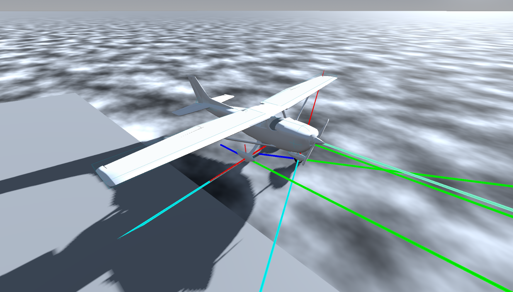

# SimiFlight

This project is a further development of my flight simulator, which I developed for my high school graduation project(Matura-Project in Switzerland).

Matura-Flightsimulator: https://nomis3d.itch.io/maturaarbeit-flugsimulator

Instead of the Unreal Engine, I am now using the Godot Engine.

The project is still in the very early stages of development. 

Currently, only simiflight_p1 (prototype for ground control of aircraft) and simiflight-curvetool (a tool for calculating lift and drag curves in the range of 0-360° alpha/angle of attack) are available.

SimiFlight is an open-source project designed to provide tools for simulating flight physics, specifically for aircraft dynamics and flight simulation in a 3D environment. The project is developed in Godot and Python, and it aims to offer a realistic and interactive flight simulation experience. 
